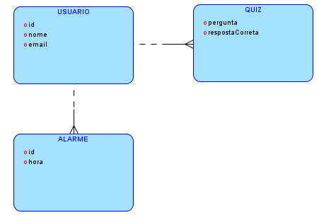
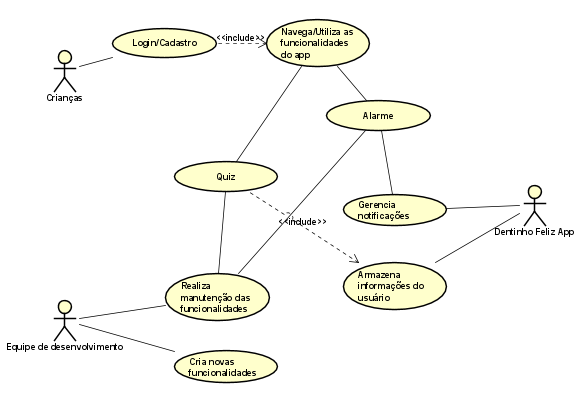

# Dentinho Feliz

3.1 Nome da Aplicação

Dentinho Feliz - Um aplicativo voltado para conscientização sobre higiene bucal infantil, utilizando gamificação para ensinar boas práticas às crianças de até 14 anos.

# 3.2 Integrantes do Grupo

    Guilherme Augusto de Oliveira (RM554176)
    Responsável pela implementação da lógica de pontuação e quizzes no aplicativo.

    Luiz Alecsander Viana (RM553034)
    Responsável pela estruturação do backend utilizando Java e integração com banco de dados, além da criação da API REST.

    Lucas Martinez Lopes (RM553816)
    Responsável pelo design do front-end e pela implementação das telas e fluxo de navegação do aplicativo.

# 3.3 Instruções para rodar a aplicação

Pré-requisitos:

    JDK 8+

    Maven

    Banco de Dados MySQL

    IDE (IntelliJ, Eclipse, etc.)

`Passos:`

`1. Clone este repositório: git clone https://github.com/luizalec7/dentinhofeliz.git`

`2. Navegue até a pasta do projeto: cd dentinhofeliz`

`3. Configure o arquivo application.properties com as credenciais do seu banco de dados MySQL.`

`4. Rode o Maven para compilar o projeto: mvn clean install`

`5. Execute a aplicação: mvn spring-boot:run`
   

`6. Acesse a API em: http://localhost:8080`

# 3.4 Diagramas

Diagrama de Classes:

Diagrama de Casos de Uso:

# 3.5 Link para Vídeo

Acesse o vídeo de apresentação da proposta tecnológica, o público-alvo e os problemas que o aplicativo Dentinho Feliz resolve através do link abaixo:
[https://youtu.be/tC7rbQUxJx8](https://youtu.be/tC7rbQUxJx8)

# 3.6 Endpoints 

AlarmeController

Prefixo: /api/alarmes

    GET /api/alarmes:
    Retorna a lista de todos os alarmes cadastrados.

    POST /api/alarmes:
    Cria um novo alarme.
    Request body: JSON com os dados do AlarmeDTO.

QuizController

Prefixo: /api/quizzes

    GET /api/quizzes:
    Retorna a lista de todos os quizzes cadastrados.

    POST /api/quizzes:
    Cria um novo quiz.
    Request body: JSON com os dados do QuizDTO.

UsuarioController

Prefixo: /api/usuarios

    GET /api/usuarios:
    Retorna a lista de todos os usuários cadastrados.

    POST /api/usuarios:
    Cria um novo usuário.
    Request body: JSON com os dados do UsuarioDTO.
    Validação: O corpo da requisição deve estar de acordo com a validação (@Valid).